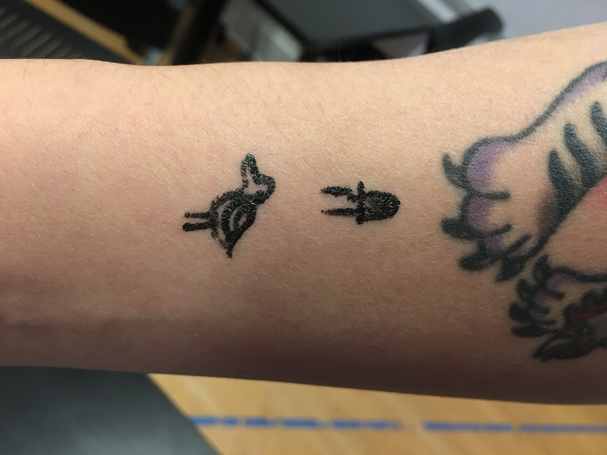

### create endurance or durational performance
__Live Tattoo__

This performance was delivered through two days at ITP for relatively short time. The performance has been intended to evoke certain feelings or reactions - hesitation, frustration, thrill, excitement, anxiety, relief - from the participent who volunteered to give a tattoo on performers body on the spot. Performer and participent could discover prompt empathy and intimacy between each other that arose from challenging body manipulation. 
[video1](https://www.youtube.com/watch?v=pG0eVe58bN8),[video2](https://www.youtube.com/watch?v=lV63kfU_I2g) 

